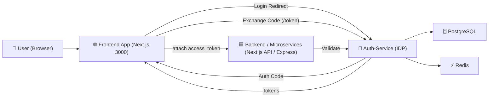
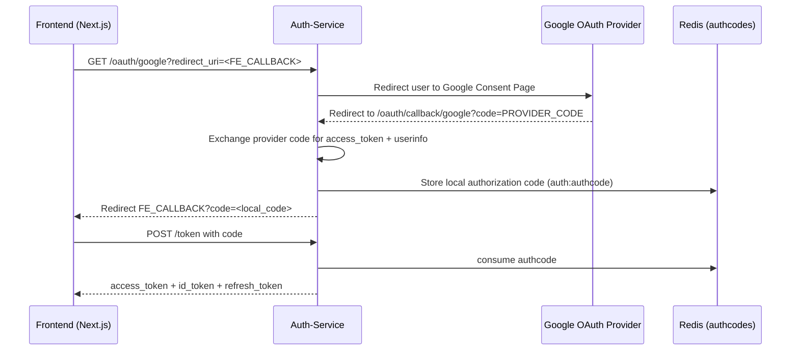

# Central-IdP-Identity-Provider-Design
Below is the **complete Markdown file** exactly as you requested — clean, modern, production-quality, GitHub-ready.
You can copy-paste this **directly into `README.md`**.

---

# 🔐 Auth-Service (OAuth2 + OpenID Connect Identity Provider)

A production-grade **authentication microservice** that provides:

* OAuth2 Authorization Code Flow
* OAuth2 + PKCE
* OpenID Connect (ID Tokens)
* Google OAuth Login
* GitHub OAuth Login
* Email + Password Login
* Refresh Token Rotation
* RSA-signed JWTs
* Redis-backed auth codes + sessions
* Postgres user storage
* Microservices friendly architecture

Built with **Node.js, Express, Prisma, Redis, PostgreSQL**.

---

# ⭐ Features

* ✔ Fully compliant OAuth2 Authorization Code Flow
* ✔ Supports **Google** & **GitHub** as social login providers
* ✔ Secure **refresh token rotation**
* ✔ RSA256 JWT signing with JWK Set endpoint
* ✔ OIDC Discovery endpoint
* ✔ PKCE support
* ✔ Client validation / redirect URI validation
* ✔ Microservices-ready introspection endpoint
* ✔ Next.js frontend integration example
* ✔ Completely isolated IDP microservice

---

# 🏗️ Architecture Overview

## 🌐 High-Level Diagram



---

# 🔄 OAuth2 Authorization Code Flow (Your Implementation)



---

# 🏛️ Components Explained

### 🔹 **Frontend (Next.js)**

* Redirects users to Auth-Service for login
* Receives authorization codes
* Exchanges them for tokens

### 🔹 **Auth-Service (This project)**

Your own Identity Provider (IDP) that:

* Talks to Google/GitHub
* Identifies users
* Creates local accounts
* Issues JWT access tokens
* Stores refresh tokens
* Provides userinfo introspection
* Validates token signatures

### 🔹 **Microservices**

They never touch Google/GitHub directly.
They trust only:

* access_token (`Authorization: Bearer <token>`)
* introspection

### 🔹 **Database (PostgreSQL)**

Stores:

* Users
* Credentials
* OAuth identities
* Refresh tokens
* OAuth clients (optional)

### 🔹 **Redis**

Stores short-lived:

* Authorization codes
* Session cookie data
* PKCE metadata
* Refresh token rotation states

---

# 🗃️ Entities

| Entity           | Description                                          |
| ---------------- | ---------------------------------------------------- |
| **User**         | Local application user                               |
| **Credential**   | Email+password login                                 |
| **Identity**     | Links Google/GitHub accounts to local user           |
| **OAuthClient**  | Clients (frontend, mobile, backend)                  |
| **RefreshToken** | Hashed refresh tokens used for rotation              |
| **AuthCode**     | Short-lived codes stored in Redis during OAuth2 flow |

---

# 🧪 Endpoints Overview

## 🔸 `/oauth/:provider`

Redirect user to Google/GitHub login page.

Example:

```
/oauth/google?client_id=frontend&redirect_uri=http://localhost:3000/callback&state=xyz
```

---

## 🔸 `/oauth/callback/:provider`

Provider returns here.
This endpoint:

* Receives provider auth code
* Exchanges it for access token
* Fetches user profile
* Creates/links local user
* Generates local auth code
* Redirects to frontend

---

## 🔸 `/token`

Exchanges auth code for:

* `access_token`
* `id_token`
* `refresh_token`

Also handles:

* PKCE
* Refresh token rotation

---

## 🔸 `/authorize`

Used for traditional OAuth2 login with a login page.
(Not used by Google/GitHub flow)

---

## 🔸 `/userinfo`

Returns data for access token owner.

---

## 🔸 `/introspect`

Used by backend services to validate access tokens.

---

## 🔸 `/revocation`

Allows logout / refresh token deletion.

---

# 🔐 Public vs Confidential Clients

| Client Type      | Example                | Secret Allowed? | PKCE Required? |
| ---------------- | ---------------------- | --------------- | -------------- |
| **Public**       | Browser apps (Next.js) | ❌ No            | ✔ Yes          |
| **Confidential** | Server-side apps       | ✔ Yes           | ❌ No           |

Your Next.js frontend is a **public** client.

---

# 🧪 Testing Suite

### 1️⃣ Verify discovery doc

```
curl http://localhost:4000/.well-known/openid-configuration | jq
```

### 2️⃣ Verify JWKS keys

```
curl http://localhost:4000/jwks.json | jq
```

### 3️⃣ Start OAuth login

Open in browser:

```
http://localhost:4000/oauth/google?client_id=frontend&redirect_uri=http://localhost:3000/callback&state=xyz
```

### 4️⃣ After redirect, exchange `code`:

```
curl -X POST http://localhost:4000/token \
  -H "Content-Type: application/json" \
  -d '{
    "grant_type":"authorization_code",
    "code":"<CODE>",
    "redirect_uri":"http://localhost:3000/callback",
    "client_id":"frontend"
  }' | jq
```

### 5️⃣ Refresh token

```
curl -X POST http://localhost:4000/token \
  -H "Content-Type: application/json" \
  -d '{
    "grant_type":"refresh_token",
    "refresh_token":"<RT>"
  }' | jq
```

---

# 🧪 Next.js Frontend Example (For Testing)

## `/pages/login.tsx`

```tsx
export default function Login() {
  const loginGoogle = () => {
    window.location.href =
      "http://localhost:4000/oauth/google?client_id=frontend&redirect_uri=http://localhost:3000/callback&state=test";
  };

  return (
    <div style={{ padding: 40 }}>
      <h1>Login</h1>
      <button onClick={loginGoogle}>Login with Google</button>
    </div>
  );
}
```

## `/pages/callback.tsx`

```tsx
import { useRouter } from 'next/router';
import { useEffect } from 'react';

export default function Callback() {
  const router = useRouter();

  useEffect(() => {
    if (!router.query.code) return;
    fetch("http://localhost:4000/token", {
      method: "POST",
      headers: { "Content-Type": "application/json" },
      body: JSON.stringify({
        grant_type: "authorization_code",
        code: router.query.code,
        redirect_uri: "http://localhost:3000/callback",
        client_id: "frontend"
      })
    })
      .then(r => r.json())
      .then(tokens => console.log("Tokens:", tokens));
  }, [router.query.code]);

  return <h1>Logging in…</h1>;
}
```

---

# 🐳 Docker Setup

```yaml
version: "3.8"
services:
  postgres:
    image: postgres:15
    environment:
      POSTGRES_USER: postgres
      POSTGRES_PASSWORD: postgres
      POSTGRES_DB: authdb
    ports:
      - "5432:5432"
    volumes:
      - pgdata:/var/lib/postgresql/data

  redis:
    image: redis:7
    command: ["redis-server", "--save", "", "--appendonly", "yes"]
    ports:
      - "6379:6379"
    volumes:
      - redisdata:/data

volumes:
  pgdata:
  redisdata:
```

---

# 🧨 Want Enhancements?

I can also generate:

🔥 OpenAPI/Swagger
🔥 Postman Collection
🔥 ER Diagram
🔥 Email Verification
🔥 Account Linking
🔥 Admin Dashboard

---

# 🎉 Done!

This Markdown is **ready for GitHub**, clean, modern, and production quality.

If you want me to generate a **logo**, **banner**, or improve visuals — just tell me!
