# Central-IdP-Identity-Provider-Design
Below is the **complete Markdown file** exactly as you requested — clean, modern, production-quality, GitHub-ready.
You can copy-paste this **directly into `README.md`**.

---

# 🔐 Auth-Service (OAuth2 + OpenID Connect Identity Provider)

A production-grade **authentication microservice** that provides:

* OAuth2 Authorization Code Flow
* OAuth2 + PKCE
* OpenID Connect (ID Tokens)
* Google OAuth Login
* GitHub OAuth Login
* Email + Password Login
* Refresh Token Rotation
* RSA-signed JWTs
* Redis-backed auth codes + sessions
* Postgres user storage
* Microservices friendly architecture

Built with **Node.js, Express, Prisma, Redis, PostgreSQL**.

---

# ⭐ Features

* ✔ Fully compliant OAuth2 Authorization Code Flow
* ✔ Supports **Google** & **GitHub** as social login providers
* ✔ Secure **refresh token rotation**
* ✔ RSA256 JWT signing with JWK Set endpoint
* ✔ OIDC Discovery endpoint
* ✔ PKCE support
* ✔ Client validation / redirect URI validation
* ✔ Microservices-ready introspection endpoint
* ✔ Next.js frontend integration example
* ✔ Completely isolated IDP microservice

---

# 🏗️ Architecture Overview

## 🌐 High-Level Diagram

```mermaid
flowchart LR
    User["🧑 User (Browser)"]
    FE["🌐 Frontend App (Next.js 3000)"]
    BE["🟦 Backend / Microservices (Next.js API / Express)"]
    AUTH["🔐 Auth-Service (IDP)"]
    PG["🗄️ PostgreSQL"]
    REDIS["⚡ Redis"]

    User --> FE
    FE -- "Login Redirect" --> AUTH
    AUTH -- "Auth Code" --> FE
    FE -- "Exchange Code (/token)" --> AUTH
    AUTH -- "Tokens" --> FE
    FE -- "attach access_token" --> BE
    BE -- "Validate" --> AUTH
    AUTH --> PG
    AUTH --> REDIS

```


---

# 🔐 **OAuth2 Authorization Code Flow — Full Detailed Diagram**

```mermaid
sequenceDiagram
    autonumber

    participant User as 🧑 User (Browser)
    participant FE as 🌐 Frontend (Next.js)
    participant AUTH as 🔐 Auth-Service (IDP)
    participant Provider as 🌈 OAuth Provider (Google/GitHub)
    participant Redis as ⚡ Redis (authcodes)
    participant DB as 🗄️ Postgres (Users/Identity)

    %% --- STEP 1: USER STARTS LOGIN ---
    User->>FE: Click "Continue with Google/GitHub"
    FE->>AUTH: GET /oauth/google?redirect_uri=<FE_CALLBACK>&client_id=frontend&state=xyz

    %% --- STEP 2: REDIRECT TO PROVIDER ---
    AUTH->>Provider: Redirect to Google/GitHub<br/>client_id, server_redirect_uri,<br/>state=encoded(clientRedirect+client_id+origState)
    
    %% --- STEP 3: PROVIDER LOGIN ---
    User->>Provider: Authenticate (Google/GitHub Login)
    Provider-->>AUTH: Redirect back to<br/>/oauth/callback/google?code=PROVIDER_CODE&state=ENC_STATE

    %% --- STEP 4: EXCHANGE PROVIDER CODE ---
    AUTH->>Provider: POST /token (exchange code)<br/>client_secret + server_redirect_uri
    Provider-->>AUTH: access_token + id_token + profile
    
    %% --- STEP 5: LINK / CREATE LOCAL USER ---
    AUTH->>DB: Find Identity(provider, providerUserId)
    alt Identity Found
        DB-->>AUTH: Return linked user
    else No Identity Found
        AUTH->>DB: Find/Create User by email
        AUTH->>DB: Insert Identity(provider_userId → user)
        DB-->>AUTH: Return new user
    end

    %% --- STEP 6: CREATE INTERNAL AUTH CODE ---
    AUTH->>Redis: SET auth:authcode:<code><br/>{ userId, clientId, redirectUri, scope }

    %% --- STEP 7: REDIRECT BACK TO FRONTEND ---
    AUTH-->>FE: Redirect FE_CALLBACK?code=<local_auth_code>&state=xyz

    %% --- STEP 8: FRONTEND EXCHANGES CODE ---
    FE->>AUTH: POST /token<br/>{ grant_type: "authorization_code", code, redirect_uri }

    %% --- STEP 9: AUTH SERVICE VALIDATES CODE ---
    AUTH->>Redis: GET auth:authcode:<code>
    Redis-->>AUTH: { userId, clientId, redirectUri, scope }
    AUTH->>Redis: DEL auth:authcode:<code>

    %% --- STEP 10: RETURN TOKENS TO FRONTEND ---
    AUTH->>AUTH: Issue access_token + id_token + refresh_token
    AUTH-->>FE: { access_token, id_token, refresh_token }
```



---

# 📘 **Detailed Explanation (Step-by-Step)**

### **1. User starts login**

Frontend calls:

```
GET /oauth/google?redirect_uri=http://localhost:3000/callback&state=xyz&client_id=frontend
```

---

### **2. Auth-Service redirects to Google/GitHub**

Auth-Service **does NOT pass frontend redirect** to Google.

It uses its **own registered redirect_uri**:

```
http://localhost:4000/oauth/callback/google
```

And encodes frontend redirect inside `state`.

---

### **3. User logs in with Google/GitHub**

The provider redirects back to your backend:

```
/oauth/callback/google?code=PROVIDER_CODE&state=ENCODED
```

---

### **4. Auth-Service exchanges code with provider**

Calls Google/GitHub:

```
POST https://oauth2.googleapis.com/token
```

Receives provider access_token + profile.

---

### **5. Auth-Service links/creates local user**

* If identity exists → load user
* If email found → attach identity
* If new user → create record + identity row

Stored in PostgreSQL.

---

### **6. Auth-Service creates internal authorization code**

Stores in Redis:

```
auth:authcode:<random>
{
   userId,
   clientId,
   redirectUri,
   scope
}
```

TTL: 5 minutes (configurable).

---

### **7. Redirects back to frontend**

```
http://localhost:3000/callback?code=<internal_code>&state=xyz
```

---

### **8. Frontend exchanges code for tokens**

```
POST /token
{
  grant_type: "authorization_code",
  code,
  redirect_uri
}
```

---

### **9. Auth-Service validates the code**

* Check Redis
* Validate redirect_uri
* Check PKCE (if used)
* Delete authcode

---

### **10. Auth-Service returns tokens**

```
{
  access_token,
  id_token,
  refresh_token,
  expires_in
}
```

Tokens are signed using **your RSA private key**.


# 🏛️ Components Explained

### 🔹 **Frontend (Next.js)**

* Redirects users to Auth-Service for login
* Receives authorization codes
* Exchanges them for tokens

### 🔹 **Auth-Service (This project)**

Your own Identity Provider (IDP) that:

* Talks to Google/GitHub
* Identifies users
* Creates local accounts
* Issues JWT access tokens
* Stores refresh tokens
* Provides userinfo introspection
* Validates token signatures

### 🔹 **Microservices**

They never touch Google/GitHub directly.
They trust only:

* access_token (`Authorization: Bearer <token>`)
* introspection

### 🔹 **Database (PostgreSQL)**

Stores:

* Users
* Credentials
* OAuth identities
* Refresh tokens
* OAuth clients (optional)

### 🔹 **Redis**

Stores short-lived:

* Authorization codes
* Session cookie data
* PKCE metadata
* Refresh token rotation states

---

# 🗃️ Entities

| Entity           | Description                                          |
| ---------------- | ---------------------------------------------------- |
| **User**         | Local application user                               |
| **Credential**   | Email+password login                                 |
| **Identity**     | Links Google/GitHub accounts to local user           |
| **OAuthClient**  | Clients (frontend, mobile, backend)                  |
| **RefreshToken** | Hashed refresh tokens used for rotation              |
| **AuthCode**     | Short-lived codes stored in Redis during OAuth2 flow |

---

# 🧪 Endpoints Overview

## 🔸 `/oauth/:provider`

Redirect user to Google/GitHub login page.

Example:

```
/oauth/google?client_id=frontend&redirect_uri=http://localhost:3000/callback&state=xyz
```

---

## 🔸 `/oauth/callback/:provider`

Provider returns here.
This endpoint:

* Receives provider auth code
* Exchanges it for access token
* Fetches user profile
* Creates/links local user
* Generates local auth code
* Redirects to frontend

---

## 🔸 `/token`

Exchanges auth code for:

* `access_token`
* `id_token`
* `refresh_token`

Also handles:

* PKCE
* Refresh token rotation

---

## 🔸 `/authorize`

Used for traditional OAuth2 login with a login page.
(Not used by Google/GitHub flow)

---

## 🔸 `/userinfo`

Returns data for access token owner.

---

## 🔸 `/introspect`

Used by backend services to validate access tokens.

---

## 🔸 `/revocation`

Allows logout / refresh token deletion.

---

# 🔐 Public vs Confidential Clients

| Client Type      | Example                | Secret Allowed? | PKCE Required? |
| ---------------- | ---------------------- | --------------- | -------------- |
| **Public**       | Browser apps (Next.js) | ❌ No            | ✔ Yes          |
| **Confidential** | Server-side apps       | ✔ Yes           | ❌ No           |

Your Next.js frontend is a **public** client.

---

# 🧪 Testing Suite

### 1️⃣ Verify discovery doc

```
curl http://localhost:4000/.well-known/openid-configuration | jq
```

### 2️⃣ Verify JWKS keys

```
curl http://localhost:4000/jwks.json | jq
```

### 3️⃣ Start OAuth login

Open in browser:

```
http://localhost:4000/oauth/google?client_id=frontend&redirect_uri=http://localhost:3000/callback&state=xyz
```

### 4️⃣ After redirect, exchange `code`:

```
curl -X POST http://localhost:4000/token \
  -H "Content-Type: application/json" \
  -d '{
    "grant_type":"authorization_code",
    "code":"<CODE>",
    "redirect_uri":"http://localhost:3000/callback",
    "client_id":"frontend"
  }' | jq
```

### 5️⃣ Refresh token

```
curl -X POST http://localhost:4000/token \
  -H "Content-Type: application/json" \
  -d '{
    "grant_type":"refresh_token",
    "refresh_token":"<RT>"
  }' | jq
```

---

# 🧪 Next.js Frontend Example (For Testing)

## `/pages/login.tsx`

```tsx
export default function Login() {
  const loginGoogle = () => {
    window.location.href =
      "http://localhost:4000/oauth/google?client_id=frontend&redirect_uri=http://localhost:3000/callback&state=test";
  };

  return (
    <div style={{ padding: 40 }}>
      <h1>Login</h1>
      <button onClick={loginGoogle}>Login with Google</button>
    </div>
  );
}
```

## `/pages/callback.tsx`

```tsx
import { useRouter } from 'next/router';
import { useEffect } from 'react';

export default function Callback() {
  const router = useRouter();

  useEffect(() => {
    if (!router.query.code) return;
    fetch("http://localhost:4000/token", {
      method: "POST",
      headers: { "Content-Type": "application/json" },
      body: JSON.stringify({
        grant_type: "authorization_code",
        code: router.query.code,
        redirect_uri: "http://localhost:3000/callback",
        client_id: "frontend"
      })
    })
      .then(r => r.json())
      .then(tokens => console.log("Tokens:", tokens));
  }, [router.query.code]);

  return <h1>Logging in…</h1>;
}
```

---

# 🐳 Docker Setup

```yaml
version: "3.8"
services:
  postgres:
    image: postgres:15
    environment:
      POSTGRES_USER: postgres
      POSTGRES_PASSWORD: postgres
      POSTGRES_DB: authdb
    ports:
      - "5432:5432"
    volumes:
      - pgdata:/var/lib/postgresql/data

  redis:
    image: redis:7
    command: ["redis-server", "--save", "", "--appendonly", "yes"]
    ports:
      - "6379:6379"
    volumes:
      - redisdata:/data

volumes:
  pgdata:
  redisdata:
```

---

Awesome—here’s a clean, implementable IdP design (OAuth2 + OIDC) with Google/GitHub social and email+password. At the end, you’ll find **copy-paste usage guides for every client type** (Next.js, SPA, mobile, BFF, microservices, gateway, workers, CLI, service-to-service).

---

# IdP you’ll build (overview)

**Features**

* OIDC/OAuth2: `authorization_code + PKCE`, `refresh_token`, `client_credentials`.
* Social federation: **Google** & **GitHub**.
* First-party auth: **email + password** (argon2id).
* Tokens: **JWT** (ID + Access), **rotating opaque Refresh**.
* JWKS with key rotation; discovery document.
* Consent, email verification, password reset, RP-initiated logout.

**Core endpoints**

```
GET  /.well-known/openid-configuration
GET  /.well-known/jwks.json
GET  /authorize
POST /token
GET  /userinfo
POST /revoke
POST /introspect          (optional if access tokens are opaque)
POST /logout              (RP-initiated)
GET  /login/google        (federation entry)
GET  /login/google/callback
GET  /login/github
GET  /login/github/callback
POST /login/password      (IdP UI post – not public OAuth)
POST /register
POST /verify-email
POST /forgot-password
POST /reset-password
```

**Token lifetimes (sane defaults)**

* Access / ID: **10 minutes**
* Refresh (rotating): **45 days**, per device; breach-detect on reuse.
* JWKS cache TTL for verifiers: **5–15 minutes**

**Storage**

* Postgres: users, external identities, clients, auth codes, refresh tokens, consents, keys.
* Redis: short-lived artifacts (auth codes cache, PKCE verifiers, rate limits).

**Security musts**

* argon2id for passwords; email verification before issuing refresh tokens
* PKCE **required** for public clients
* Strict `state` + `nonce`
* Rate-limit `/authorize`, `/token`, `/login/*`
* Store **hash** of refresh tokens (never plaintext)
* Rotate signing keys; publish **JWKS** (`kid`)

---

# Minimal discovery & claims (examples)

**/.well-known/openid-configuration**

```json
{
  "issuer": "https://idp.example.com",
  "authorization_endpoint": "https://idp.example.com/authorize",
  "token_endpoint": "https://idp.example.com/token",
  "userinfo_endpoint": "https://idp.example.com/userinfo",
  "jwks_uri": "https://idp.example.com/.well-known/jwks.json",
  "response_types_supported": ["code"],
  "grant_types_supported": ["authorization_code","refresh_token","client_credentials"],
  "scopes_supported": ["openid","profile","email","offline_access"],
  "code_challenge_methods_supported": ["S256"],
  "id_token_signing_alg_values_supported": ["RS256","EdDSA"]
}
```

**ID token (typical)**

```json
{
  "iss":"https://idp.example.com",
  "sub":"usr_123",
  "aud":"client_abc",
  "exp":1732440000,"iat":1732439400,"auth_time":1732439388,
  "nonce":"<from /authorize>",
  "email":"ashutosh@example.com","email_verified":true,
  "name":"Ashutosh"
}
```

---

# Federation mapping (Google/GitHub)

* After provider callback, map (`iss`,`sub`) to `external_identities`.
* If verified email matches an existing user, **link**; else **provision** user (mark `email_verified=true` if provider says so).
* Continue standard OIDC: produce your **authorization code**, then **your** tokens.

---

# Refresh rotation (breach detection)

* On `grant_type=refresh_token`:

  * Issue new Access + new Refresh (`jti2`), mark old (`jti1 → replaced_by=jti2`).
  * If `jti1` used again → revoke **entire chain** for that device (session hijack).

---

# USAGE BY CLIENT TYPE (copy-paste)

## 1) Next.js (with NextAuth as **OIDC client**)

```ts
// app/api/auth/[...nextauth]/route.ts
import NextAuth from "next-auth";
import OpenID from "next-auth/providers/openidconnect";

const handler = NextAuth({
  providers: [
    OpenID({
      issuer: process.env.OIDC_ISSUER!,            // https://idp.example.com
      clientId: process.env.OIDC_CLIENT_ID!,
      clientSecret: process.env.OIDC_CLIENT_SECRET!,
      checks: ["pkce", "state", "nonce"],
    }),
  ],
  session: { strategy: "jwt" },
  callbacks: {
    async jwt({ token, account }) {
      if (account?.access_token) {
        token.accessToken = account.access_token;
        token.refreshToken = account.refresh_token;
        token.expiresAt = Date.now() + account.expires_in! * 1000;
      }
      return token;
    },
    async session({ session, token }) {
      (session as any).accessToken = token.accessToken;
      return session;
    },
  },
});
export { handler as GET, handler as POST };
```

**SSR/Server Action call to your API**

```ts
const res = await fetch(`${process.env.API}/videos`, {
  headers: { Authorization: `Bearer ${session.accessToken}` },
});
```

**Do not** store refresh tokens in the browser; keep them server-side if you implement rotation in a BFF.

---

## 2) SPA (React/Vue) without NextAuth (PKCE)

Use a lightweight OIDC client (e.g., oidc-client-ts) or do it manually:

**Start login**

```ts
const verifier = base64url(randomBytes(32));
const challenge = base64url(sha256(verifier));
sessionStorage.setItem("pkce_verifier", verifier);

const url = new URL("https://idp.example.com/authorize");
url.search = new URLSearchParams({
  client_id: "spa_client",
  redirect_uri: "https://app.example.com/callback",
  response_type: "code",
  scope: "openid email profile",
  state: crypto.randomUUID(),
  nonce: crypto.randomUUID(),
  code_challenge: challenge,
  code_challenge_method: "S256",
}).toString();
location.assign(url.toString());
```

**Exchange code (in callback page)**

```ts
const code = new URL(location.href).searchParams.get("code")!;
const verifier = sessionStorage.getItem("pkce_verifier")!;
const resp = await fetch("https://idp.example.com/token", {
  method: "POST",
  headers: { "Content-Type": "application/x-www-form-urlencoded" },
  body: new URLSearchParams({
    grant_type: "authorization_code",
    client_id: "spa_client",
    redirect_uri: "https://app.example.com/callback",
    code, code_verifier: verifier
  }),
});
const { access_token, id_token, expires_in } = await resp.json();
```

---

## 3) Mobile apps (iOS/Android)

* Use **AppAuth** (iOS/Android). Configure PKCE; redirect using custom scheme.
* Store **access token** in memory/Keychain; **never** store refresh token unless you control a secure BFF; otherwise use **token exchange** via your BFF.

---

## 4) Backend-for-Frontend (BFF) pattern

* Browser only holds **short-lived** session cookie to BFF.
* BFF stores refresh token server-side (httpOnly cookie to your domain maps to a server session).
* BFF exchanges/refreshes and attaches **access token** to downstream API calls.
* Good when you want **zero tokens in the browser**.

---

## 5) Microservices (resource servers)

Validate the **access token JWT** locally using JWKS.

**Node (jose)**

```ts
import { createRemoteJWKSet, jwtVerify } from "jose";
const JWKS = createRemoteJWKSet(new URL("https://idp.example.com/.well-known/jwks.json"));

export async function verifyAuth(bearer: string) {
  const token = bearer?.replace(/^Bearer\s+/i,"");
  const { payload } = await jwtVerify(token!, JWKS, {
    issuer: "https://idp.example.com",
    audience: "videos-api", // your API audience
  });
  return payload; // { sub, email, scope, ... }
}
```

**Go (github.com/golang-jwt/jwt/v5 + JWKS)**

```go
// Pseudocode: fetch & cache JWKS, select key by kid, verify RS256/EdDSA, then check iss/aud/exp/nbf.
```

**AuthZ**

* Use `scope` or custom claims (`roles`, `org_id`) for RBAC/ABAC.

---

## 6) API Gateway (Kong/Envoy/NGINX)

**Kong OIDC (concept)**

* Configure: `issuer = https://idp.example.com`, `client_id`, `client_secret` (if using auth flow at the edge), `scopes = openid`.
* Validate `access_token` on each request; enforce `aud=serviceX`, required scopes.
* Strip Authorization before proxying if you want zero trust between tiers; or pass upstream.

**Envoy filter**

* `jwt_authn` with `providers` → `issuer`, `jwks_uri`, `audiences`.
* `require_any` or `requires` per route.

---

## 7) Service-to-Service (Client Credentials)

For jobs/cron/internal services (no user):

**Token fetch**

```bash
curl -u client_id:client_secret \
  -d 'grant_type=client_credentials&scope=videos.read' \
  https://idp.example.com/token
```

Attach `Authorization: Bearer <access_token>` to internal API calls. Use **short TTL** (5–10 min).

---

## 8) Workers/Jobs (user-on-behalf, optional)

If a worker must act **on behalf of a user**, implement a token exchange/on-behalf-of flow (RFC 8693) in the IdP or let the BFF enqueue jobs with **its own service token** plus a signed job claim (avoid handing refresh tokens to workers).

---

## 9) CLI & Device Flow (optional but handy)

For headless login on TVs/CLI:

* Implement **Device Authorization Grant**: `/device/code` → user visits verification URI, enters code; CLI polls `/token`.
* Result: Access/refresh for that device; still rotate refresh tokens.

---

## 10) Webhooks from your services (verify issuer)

When your services emit webhooks to each other, sign payloads with a short-lived **JWT** issued by the IdP (aud=receiver). Receivers verify via JWKS just like any resource server.

---

## 11) Logout flows

**RP-initiated logout**

```http
POST /logout
Cookie: session=...
Body: id_token_hint=...&post_logout_redirect_uri=https://app.example.com
```

* Server: revoke device’s refresh chain; clear session cookie; optionally front/back-channel logout to relying parties.

---

## 12) cURL snippets for common flows

**Auth Code → Tokens**

```bash
curl -X POST https://idp.example.com/token \
  -H "Content-Type: application/x-www-form-urlencoded" \
  -d "grant_type=authorization_code&code=$CODE&redirect_uri=$REDIRECT&client_id=$CLIENT_ID&code_verifier=$VERIFIER"
```

**Refresh**

```bash
curl -X POST https://idp.example.com/token \
  -H "Content-Type: application/x-www-form-urlencoded" \
  -d "grant_type=refresh_token&refresh_token=$RT&client_id=$CLIENT_ID"
```

**UserInfo**

```bash
curl -H "Authorization: Bearer $AT" https://idp.example.com/userinfo
```

**Revoke**

```bash
curl -X POST https://idp.example.com/revoke \
  -H "Content-Type: application/x-www-form-urlencoded" \
  -d "token=$RT&token_type_hint=refresh_token&client_id=$CLIENT_ID"
```

---

Sure ✅
Here’s your **complete custom IdP (Identity Provider)** design — with OAuth2 + OIDC support, social logins (Google & GitHub), email/password login, refresh rotation, and usage examples for **every client type** — now with a clean **footer section** summarizing everything.

---

# 🧩 FOOTER — QUICK SUMMARY & IMPLEMENTATION CHECKLIST

### ✅ Core Concepts Recap

| Layer                              | Responsibility                               | Key Notes                                    |
| ---------------------------------- | -------------------------------------------- | -------------------------------------------- |
| **IdP (Your Service)**             | Centralized authentication + token issuance  | Implements OAuth2 & OIDC standards           |
| **Clients (Next.js, SPA, Mobile)** | Request tokens using `/authorize` & `/token` | Must support PKCE for public apps            |
| **Microservices / APIs**           | Verify tokens (JWT/JWKS)                     | Must check `iss`, `aud`, `exp` claims        |
| **Gateway**                        | Enforce scopes, audience, and trust boundary | Offload token validation from inner services |

---

### 🔑 Tokens & Lifetimes

| Token Type        | Lifetime   | Usage                      | Rotation                         |
| ----------------- | ---------- | -------------------------- | -------------------------------- |
| **Access Token**  | 10 min     | For API requests           | No rotation; reissued            |
| **ID Token**      | 10 min     | User identity (UI/session) | No rotation                      |
| **Refresh Token** | 30–45 days | To get new access tokens   | Rotating, breach-detect on reuse |

---

### ⚙️ Security Best Practices

* ✅ **argon2id** for passwords
* ✅ Enforce **PKCE + state + nonce**
* ✅ Sign JWTs with **RS256 or EdDSA**
* ✅ Publish and rotate **JWKS keys**
* ✅ **Rate limit** login/token routes
* ✅ Use **refresh token rotation + device binding**
* ✅ Validate all tokens on **gateway or service entrypoint**
* ✅ Always **use HTTPS** (no plain HTTP even in dev)
* ✅ Use **HttpOnly + SameSite cookies** for browser sessions
* ✅ Keep **issuer (`iss`) stable** across regions

---

### 🧰 Recommended Tech Stack

| Component              | Suggested Tools                                               |
| ---------------------- | ------------------------------------------------------------- |
| **Language/Framework** | Go (Chi/Fosite) or Node (Fastify + `oidc-provider` or `jose`) |
| **Database**           | PostgreSQL                                                    |
| **Cache**              | Redis (for PKCE, rate limits, short-lived artifacts)          |
| **Mail Service**       | Resend / Postmark / SES                                       |
| **Key Storage**        | Cloud KMS / HSM                                               |
| **Gateway**            | Kong / Envoy / NGINX with JWT plugin                          |
| **Metrics**            | Prometheus + Grafana or OpenTelemetry                         |

---

### 🧩 Federation Providers (built-in)

| Provider           | Protocol    | Notes                                                     |
| ------------------ | ----------- | --------------------------------------------------------- |
| **Google**         | OIDC        | Provides verified email                                   |
| **GitHub**         | OAuth2      | Use `/emails` API to fetch verified primary email         |
| **Email/Password** | First-party | Requires email verification before issuing refresh tokens |

---

### 📦 Client Summary (Quick View)

| Client Type            | Flow                                   | Recommended Strategy                  |
| ---------------------- | -------------------------------------- | ------------------------------------- |
| **Next.js**            | OIDC Authorization Code (via NextAuth) | Secure server-side session + JWT      |
| **SPA (React/Vue)**    | Authorization Code + PKCE              | Use `oidc-client-ts`                  |
| **Mobile**             | Authorization Code + PKCE              | Use `AppAuth` SDKs                    |
| **BFF**                | Server holds refresh token             | Token exchange per request            |
| **Microservice**       | JWT Validation                         | Verify signature + `aud/iss`          |
| **Gateway**            | OIDC/JWT Auth Plugin                   | Central validation, scope enforcement |
| **Service-to-Service** | Client Credentials                     | Short-lived access tokens             |
| **CLI / Device**       | Device Flow                            | User verification URI method          |

---

### 🧮 Example JWT Verification Logic

```js
import { createRemoteJWKSet, jwtVerify } from "jose";
const JWKS = createRemoteJWKSet(new URL("https://idp.example.com/.well-known/jwks.json"));
export async function verify(token) {
  const { payload } = await jwtVerify(token, JWKS, {
    issuer: "https://idp.example.com",
    audience: "videos-api"
  });
  return payload;
}
```

---

### 🌐 Production Deployment Tips

* 🧭 Use a **reverse proxy** (NGINX/Kong) in front of the IdP
* 🗝️ Manage **private keys** in **KMS/HSM**
* 🧩 Store **refresh tokens hashed** in Postgres
* 🚀 Deploy statelessly; cache JWKS in services for ≤15 minutes
* 🧯 Maintain **audit logs** (login, logout, token events)
* 🧾 Expose **health checks** (`/healthz`, `/readyz`) for load balancer
* 🕵️‍♂️ Observe metrics: `tokens_issued`, `refresh_used`, `revocations`, `login_failures`

---

### 🏁 TL;DR — The Golden Rules

1. **Centralize all auth in your IdP** — never in Next.js or services directly.
2. **Every token is verifiable offline** via JWKS.
3. **Never expose refresh tokens to browsers.**
4. **Rotate everything:** keys, refresh tokens, passwords, credentials.
5. **Short-lived access, long-lived refresh, and strict scopes.**

---

### ⚡Future Enhancements

* 🔒 Add **WebAuthn / Passkey** support (FIDO2)
* 🧭 Add **OIDC Dynamic Client Registration**
* 🧱 Add **SCIM 2.0** for enterprise user provisioning
* 🌍 Multi-tenant realms (`/realms/{org}`)
* 🪪 OpenID Certification (Core, Dynamic Client, Discovery)
* 🔁 Support **Token Exchange (RFC 8693)** for on-behalf-of flows

---
